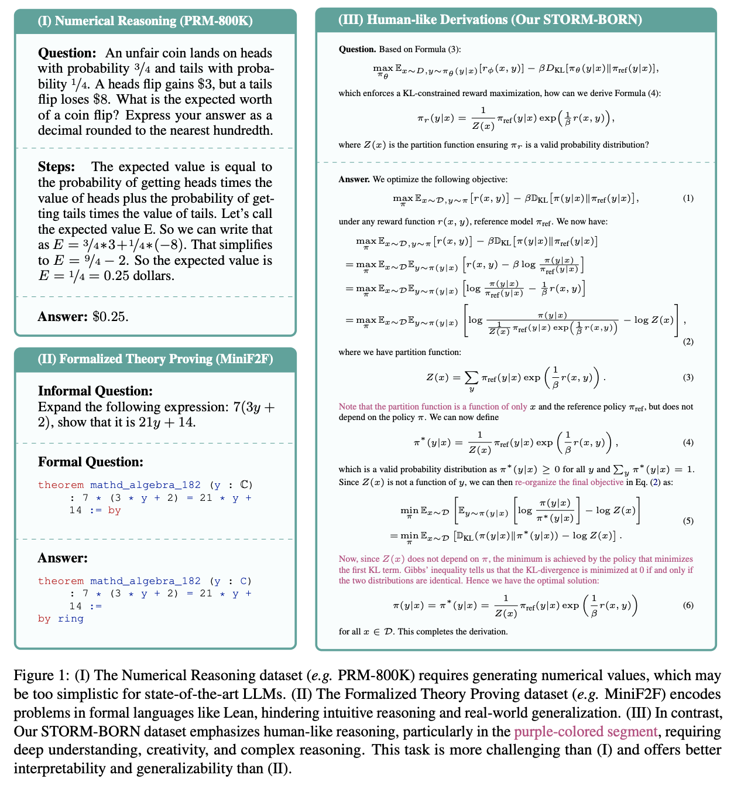
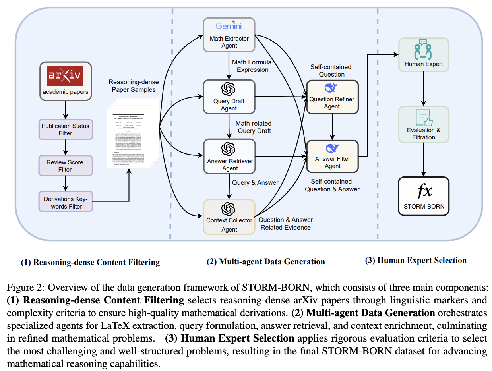

# STORM-BORN: A Challenging Mathematical Derivations Dataset

<div align="center">
<p align="center" style="font-size: larger;">
<strong> [ACL 2025] </strong> <a href="https://arxiv.org/abs/2506.01531"> STORM-BORN: A Challenging Mathematical Derivations Dataset Curated via a Human-in-the-Loop Multi-Agent Framework</a>
</p>
</div>

**STORM-BORN** is a challenging benchmark of human‐like mathematical derivations designed to push the reasoning capabilities of large language models (LLMs). 



Unlike conventional numerical or formal proofs, STORM-BORN focuses on dense, approximation-rich derivations with heuristic cues, curated from the latest academic papers and vetted by human mathematicians via a multi‐agent, human-in-the-loop framework.

This dataset can be used to fine-tune LLMs to enhance their reasoning generalization on other datasets.

It can also serve as a benchmark for evaluating models’ reasoning abilities. Because the reasoning process is difficult to evaluate automatically, we have designed a multiple-choice format that transforms the generation of correct answers into a selection task for evaluation.

## Pipeline Methods



---

## 📂 Repository Structure
```markdown

├── data
│   └── storm_born_top100.jsonl                      # 100 most difficult problems (from 2,000 samples)
|   └── storm_born_top100_choice.jsonl                 # multi_choice data converted from storm-born
│
├── data_generation
│   ├── clean_data.py              # post-process raw model outputs
│   └── generate_v1.py             # synthesize initial derivations via multi-agent pipeline
│
├── data_evaluation
│   ├── benchmark_evaluation
|   |   └── multiple_choice_eval.py    # eval LLMs on multi_choice data
│   │   └── llm_as_judge.py            # evaluate STORM-BORN with an LLM-as-Judge
│   │
│   ├── i.i.d_evaluation
│   │   └── eval_iid.py            # downstream i.i.d. task evaluation script
│   │
│   └── o.o.d_evaluation
│       └── eval_ood.py            # downstream o.o.d. task evaluation script
│
└── train
    └── axolotl                    # submodule: Axolotl SFT framework
```

---

\todo{need to change}
## 🚀 Installation

1. **Clone with submodules**  
   ```bash
   git clone --recurse-submodules <repo_url> && cd STORM-BORN
   ```

2. **Create a virtual environment**  
   ```bash
   python3 -m venv .venv && source .venv/bin/activate
   ```

3. **Install core dependencies**  
   ```bash
   pip install -r requirements.txt
   ```

4. **Install Axolotl (for SFT)**  
   ```bash
   cd train/axolotl
   pip install -e .
   cd ../..
   ```

---

## 📖 Dataset

- **`data/storm-born.jsonl`**  
  A JSONL file where each line is a problem instance:
  ```jsonc
  {
    "paper": "source of the data",
    "question": "question of the math derivation/proof",
    "whole_label": "…human-like derivation/proof…",
  }
  ```

---

## 🛠️ Data Generation

1. **Clean model outputs**  
   ```bash
   python data_generation/clean_data.py \
     --input raw_outputs.jsonl \
     --output data/storm-born.jsonl
   ```

2. **(Re)generate with multi-agent pipeline**  
   ```bash
   python data_generation/generate_v1.py \
     --config configs/gen_v1.yaml \
     --output-dir data/tmp
   ```

---

## 📊 Evaluation

### 1. Benchmark Evaluation (LLM-as-Judge)

Use an LLM to judge model answers on STORM-BORN:

```bash
python data_evaluation/benchmark_evaluation/llm_as_judge.py \
  --dataset data/storm-born.jsonl \
  --model gpt-4 \
  --output results/benchmark.json
```
### 2. Benchmark Evaluation (Choice-question)

Use an LLM to select the correct answer on STORM-BORN-CHOICE:
```bash
python data_evaluation/benchmark_evaluation/multiple_choice_eval.py \
  --dataset data/storm-born-choice.jsonl \
  --model gpt-4 \
  --output results/benchmark.json
```
### 3. Downstream Task Evaluation

After fine-tuning on STORM-BORN, assess on both in-distribution (i.i.d) and out-of-distribution (o.o.d) tasks:

- **i.i.d. evaluation**  
  ```bash
  python data_evaluation/i.i.d_evaluation/eval_iid.py \
    --model_path checkpoints/storm-born-sft \
    --dataset data/iid_task.jsonl \
    --output results/iid_results.json
  ```

- **o.o.d. evaluation**  
  ```bash
  python data_evaluation/o.o.d_evaluation/eval_ood.py \
    --model_path checkpoints/storm-born-sft \
    --dataset data/ood_task.jsonl \
    --output results/ood_results.json
  ```

---

## 🤖 Fine-Tuning (SFT)

We leverage the Axolotl framework under `train/axolotl`:

```bash
cd train/axolotl
python train.py \
  --model_name_or_path elephantai/llama-13b \
  --data_path ../../data/storm-born.jsonl \
  --output_dir ../../checkpoints/storm-born-sft \
  --batch_size 4 \
  --epochs 3 \
  --lr 2e-5
```


## 📚 Citation

If you use STORM-BORN, please cite:

```bibtex

@inproceedings{liu2025stormborn,
  title = {{STORM}-{BORN}: A Challenging Mathematical Derivations Dataset Curated via a Human-in-the-Loop Multi-Agent Framework},
  author = {Liu, Wenhao and Lu, Zhenyi and Hu, Xinyu and Zhang, Jerry and Li, Dailin and Cen, Jiacheng and Cao, Huilin and Wang, Haiteng and Li, Yuhan and Xie, Kun and Li, Dandan and Zhang, Pei and Zhang, Chengbo and Ren, Yuxiang and Ma, Yan and Huang, Xiaohong},
  booktitle = {The 63rd Annual Meeting of the Association for Computational Linguistics},
  year = {2025},
  url = {https://github.com/lwhere/STORM-BORN}
}
```

---

## ⚖️ License

This project is released under the **MIT License**. See [LICENSE](./LICENSE) for details.
```
